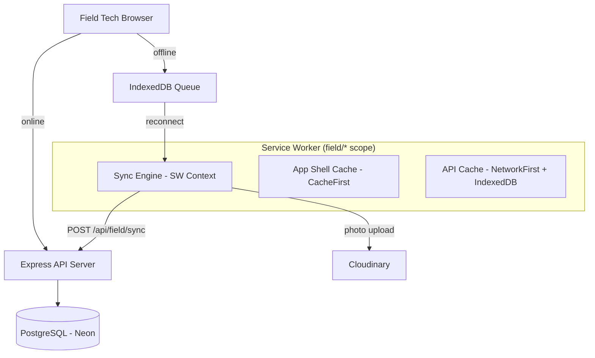

# ADR SC-OFFLINE-001: Offline Mode for Field Technicians

**Status:** Proposed  
**Date:** 2026-03-09  
**Author:** Akbar (System Architect)  
**Context Doc:** `docs/SC-OFFLINE-001-requirements.md`

---

## Context

Field technicians frequently work in locations with no cellular connectivity (crawl spaces, basements, rural properties). The current field portal (`/field/log`, `/field/history`) requires an active connection for all operations. This feature adds offline capability: local data caching, a submission queue, and automatic sync on reconnect. The stack is React + Vite, TanStack Query v5, Express/PostgreSQL. No service worker infrastructure exists today.

---

## Decision 1: Service Worker Tooling — `vite-plugin-pwa` + Workbox

**Decision:** Use [`vite-plugin-pwa`](https://vite-pwa-org.netlify.app/) to generate and manage the Service Worker. Use Workbox strategies for cache management.

**Rationale:**
- `vite-plugin-pwa` is the idiomatic Vite PWA solution. It handles cache versioning, precaching of the app shell, and service worker lifecycle automatically.
- Manual SW authoring for this scope (app shell caching + API route interception) is ~200–300 lines of fragile boilerplate. `vite-plugin-pwa` reduces this to a config block.
- Workbox's `NetworkFirst` strategy for API calls and `CacheFirst` for static assets maps exactly to the requirements.
- Actively maintained, widely adopted, compatible with TanStack Query.

**SW Scope:** `/field/*` only. Admin routes are NOT intercepted — admin portal remains online-only.

**Cache Strategies:**
| Resource | Strategy | Notes |
|----------|----------|-------|
| App shell (JS/CSS/HTML) | Cache First | Versioned cache bust on deploy via `vite-plugin-pwa` |
| `/api/field/clients` | Network First → IndexedDB fallback | 24h TTL; stale-while-revalidate |
| `/api/field/suggestions` | Network First → IndexedDB fallback | 24h TTL |
| `/api/field/custom-fields` | Network First → IndexedDB fallback | 24h TTL |
| `/api/field/job-logs` (history) | Network First → IndexedDB fallback | Last 30 days of employee logs |
| POST `/api/field/sync` | Network Only (no cache) | Queue locally; sync when online |

**Alternatives Considered:**
- **Manual Service Worker:** Full control, zero dependencies — but high maintenance cost and cache versioning bugs are common.
- **No Service Worker (IndexedDB only):** Can queue submissions offline, but cannot serve the app shell offline. If the technician's browser tab is closed, the app won't load without connectivity. Not acceptable.

---

## Decision 2: Offline Storage — IndexedDB via `idb` Library

**Decision:** Use IndexedDB (via the [`idb`](https://github.com/jakearchibald/idb) Promise wrapper) for all structured offline data. `localStorage` is retained only for existing PIN auth data.

**IndexedDB Stores:**

| Store Name | Contents | Key | TTL |
|-----------|----------|-----|-----|
| `reference_data` | Clients, locations, areas, custom fields, suggestions | `{type, employeeId}` | 24h |
| `offline_queue` | Pending job log submissions | `localId` (client UUID) | Until synced |
| `job_history_cache` | Last 30 days of employee's job logs | `jobLogId` | 30 days |

**Data scoping:** All IndexedDB data is keyed by `employeeId` to prevent cross-contamination on shared devices.

**Storage budget target:** < 50 MB total.
- Reference data: ~1 MB
- Job log queue (50 logs max): ~2 MB
- Photo blobs: up to 45 MB (photos compressed to JPEG 80% before storage — see Decision 4)

**Alternatives Considered:**
- **Raw IndexedDB API:** Works, but callback-based and verbose. `idb` is a thin, well-maintained wrapper that adds no meaningful overhead.
- **TanStack Query `persistQueryClient`:** Viable for reference data caching; reduces custom code. However, it couples offline behavior to TanStack Query's internal cache structure, making photo blob storage and the submission queue awkward. Recommend evaluating for reference data caching specifically after spike — could replace the `reference_data` store.
- **localStorage for queue:** Not suitable for binary photo data or the volume of structured data needed.

---

## Decision 3: Connection Detection — Heartbeat + `navigator.onLine`

**Decision:** Two-layer detection: `navigator.onLine` / `window online/offline` events for fast state change + a 30-second `GET /api/ping` heartbeat to confirm actual server reachability.

**New endpoint:** `GET /api/ping` → `{ ok: true }` — no auth required, no logging, minimal response.

**"Online" definition:** `navigator.onLine === true` AND the last heartbeat succeeded within 60 seconds.

**Sync trigger:** Online state transition (offline → online) triggers sync immediately — does not wait for the next 30s heartbeat tick.

**Rationale:**
- `navigator.onLine` alone is unreliable (can be `true` while on a captive portal or with no actual server reachability).
- The heartbeat is lightweight (a few bytes, no auth) and provides authoritative reachability confirmation.
- Immediate sync on reconnect is the best UX — the technician shouldn't have to wait.

---

## Decision 4: Photo Handling — Compress Before Store, Delete After Upload

**Decision:**
1. Compress photos to JPEG at 80% quality client-side (browser Canvas API) before writing to IndexedDB.
2. Upload photos to Cloudinary **after** the parent job log receives a server ID from sync.
3. Delete photo blobs from IndexedDB immediately after confirmed Cloudinary upload.
4. Photo upload failure does NOT block job log sync — log is marked `synced`, photos remain as `photo_error` and retry on next sync cycle.

**Rationale:**
- iOS Safari's IndexedDB storage can be reclaimed by the OS under storage pressure. Minimizing blob size is critical.
- Average pest control job photo compressed to 80% JPEG ≈ 500–900 KB vs. 2–4 MB raw. This keeps the 50 MB budget achievable even with 50 queued logs.
- Decoupling photo upload from job log sync means the job record is safely on the server even if Cloudinary is temporarily unavailable.

**Photo queue shape per offline log:**
```typescript
photos: Array<{
  localId: string;       // client UUID
  blob: Blob;            // JPEG 80% compressed
  caption?: string;
  status: "pending" | "uploading" | "synced" | "photo_error";
  errorMessage?: string;
}>
```

---

## Decision 5: Sync Architecture — Sequential, Service Worker Background Sync

**Decision:** Sync executes sequentially (not in parallel) per job log. Order: reference refresh → log queue flush → photo upload per log → history refresh. Implemented in service worker context using Background Sync API where available; falls back to foreground sync.

**Batch endpoint:** `POST /api/field/sync` accepts `{ jobLogs: JobLogDraft[], clientTimestamp: string }` and returns `{ results: { localId, serverId, status, error }[] }`. Server processes sequentially; partial success is valid.

**Retry strategy:** Exponential backoff: 30s → 2m → 5m → 15m → 1h. After 5 failures, mark `error` and surface manual retry to technician.

**Conflict resolution:**
- Job logs: append-only, single-author. Server deduplicates by `localId` — returning `already_synced` on duplicate prevents double-insert.
- Reference data: read-only from field; full cache replacement on sync. No write conflicts possible.
- Clock skew > 48h: server flags for admin review but accepts the record.

**Rationale:**
- Sequential sync avoids race conditions and makes error attribution unambiguous ("log #3 failed, logs #1 and #2 succeeded").
- Background Sync API ensures sync completes even if the technician backgrounds the tab — critical for mobile use.

---

## Decision 6: Auth — Re-Validate Silently on Reconnect

**Decision:** On reconnect, if the field session has expired, the app re-authenticates automatically using the stored PIN hash in IndexedDB. No UI prompt unless re-auth fails.

**Security:** PIN hash stored in IndexedDB (not plaintext). On logout (`POST /api/field/logout`), clear all employee-keyed IndexedDB data including the hash.

**Rationale:** Technicians work for hours offline. A session expiry that blocks sync on reconnect is a significant UX failure. Silent re-auth is standard in field app patterns.

---

## Architecture Diagram



---

## New Files / Changes

| File | Change |
|------|--------|
| `vite.config.ts` | Add `vite-plugin-pwa` config; scope to `/field/*` |
| `client/src/lib/offline-db.ts` | IndexedDB setup via `idb`; store definitions |
| `client/src/lib/offline-queue.ts` | Queue CRUD operations (enqueue, dequeue, update status) |
| `client/src/lib/sync-engine.ts` | Sync orchestration: reference pull → log flush → photo upload |
| `client/src/lib/connection-monitor.ts` | `navigator.onLine` + heartbeat; exports `useConnectionStatus()` hook |
| `client/src/components/offline-banner.tsx` | Status banner component (green/amber/red) |
| `client/src/pages/field-log.tsx` | Wire offline submit → queue; swap button label |
| `client/src/pages/field-history.tsx` | Show pending/error badges from queue |
| `server/routes.ts` | Add `GET /api/ping`, `POST /api/field/sync` |

---

## Consequences

**Positive:**
- Technicians can complete their full workday without connectivity — no lost data.
- Consistent UX between online and offline modes (same form, same fields).
- Service worker caches app shell — app loads instantly even on slow connections.

**Tradeoffs/Risks:**
- `vite-plugin-pwa` adds a build dependency; must be tested carefully on iOS Safari (known quirks with SW updates).
- IndexedDB storage can be cleared by iOS under storage pressure — unsynced logs could be lost. Warn technicians when storage is near quota (NFR-001).
- Background Sync API has limited Safari support — fallback to foreground sync required (sync runs on tab focus when background sync is unavailable).
- Offline capability requires HTTPS in production (service worker requirement). Dev environment needs local HTTPS or SW graceful degradation.

---

## Open Items for Mike

1. ~~Max photos per job log in practice?~~ → **Confirmed:** Max 5 photos per job log
2. Should offline-queued logs be editable before sync? (Recommend: yes with warning — OQ-002)
3. Admin notification when large batch syncs in? (OQ-003)

---

## Related

- `docs/SC-OFFLINE-001-requirements.md`
- `ARCHITECTURE.md` (existing stack)
- `FIELD-SERVICE-GUIDE.md`
