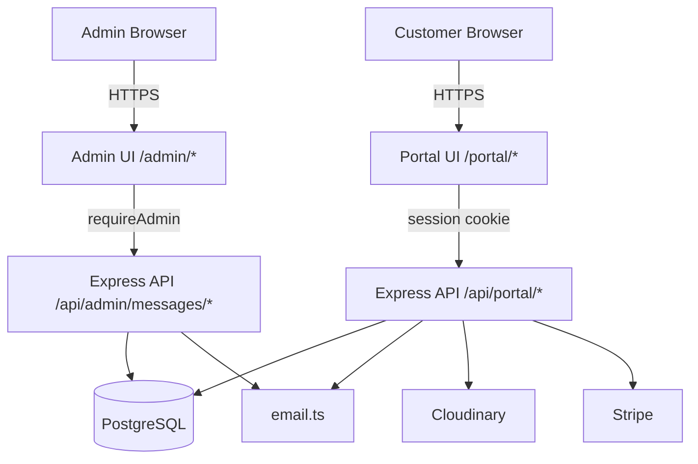

# SC-PORT-001: Customer Self-Service Portal — Architecture

**Status:** Proposed  
**Date:** 2026-03-09  
**Author:** Akbar (System Architect)  
**Related:** SC-PORT-001 requirements, ADR-003 (users↔clients link), Feature #5 (Invoice Management)

---

## Context

Absolute Pest Services needs a customer-facing self-service portal so registered users can view appointment history, book services, pay invoices, and message staff — without calling the office. The portal extends the existing auth system (`users` table, session-based) and must remain clearly distinct from the admin portal (`/admin/*`) and public marketing site.

Key prior decisions already in place:
- **ADR-003:** `clients.userId` FK links portal accounts to CRM records (enables invoice visibility)
- **`customer_messages` table:** Designed in ADR-003, added in the same migration
- **Feature #5:** Invoice data model and lifecycle already designed; portal reads from it

---

## Architecture Overview



---

## 1. Authentication

**No new auth mechanism needed.** Reuse exactly:

| Concern | Solution |
|---------|----------|
| Session | Existing `express-session` with `req.session.userId` |
| Guard | `requireAuth` middleware on all `/api/portal/*` routes |
| Role check | `role = 'user'` enforced; admins are blocked from portal endpoints |
| Redirect | Unauthenticated → redirect to `/auth` (login/register) |
| Session length | 30-day persistent (existing pattern, no change) |
| Data isolation | All queries WHERE `userId = req.session.userId` — server-enforced |

**Login entry point:** `/auth` (existing page) — customers register/log in here, then land on `/portal`.

---

## 2. Portal Routes & Pages

All routes require authentication. Unauthenticated users are redirected to `/auth`.

```
/portal                         → PortalDashboard       (summary cards + quick actions)
/portal/appointments            → PortalAppointments    (list: inspections + service requests)
/portal/appointments/new        → PortalNewAppointment  (schedule inspection form)
/portal/appointments/:id        → PortalAppointmentDetail
/portal/invoices                → PortalInvoices        (invoice list — requires Feature #5 + ADR-003)
/portal/invoices/:id            → PortalInvoiceDetail   (line items, PDF, pay button)
/portal/service-requests/new    → PortalNewServiceRequest
/portal/messages                → PortalMessages        (threaded message view)
/portal/profile                 → PortalProfile         (edit name, phone, address)
```

> **URL decision needed (Mike):** Does `/portal` replace `/dashboard` or does `/dashboard` redirect to `/portal`?  
> Recommendation: redirect `/dashboard` → `/portal` to preserve any bookmarked links.

---

## 3. API Endpoints

### Customer Portal (`requireAuth`, scoped to `req.session.userId`)

| Method | Path | Module | Notes |
|--------|------|--------|-------|
| `GET` | `/api/portal/summary` | Dashboard | Upcoming appts, outstanding balance, unread messages |
| `GET` | `/api/portal/appointments` | History | Merged: inspectionSchedules + serviceRequests |
| `GET` | `/api/portal/appointments/:id` | History | Type param: `?type=inspection\|service` |
| `POST` | `/api/portal/appointments` | Schedule | Creates `inspectionSchedules` record |
| `POST` | `/api/portal/service-requests` | Request | Creates `serviceRequests` record |
| `GET` | `/api/portal/invoices` | Invoices | Excludes draft/void; requires `clients.userId` link |
| `GET` | `/api/portal/invoices/:id` | Invoices | Auto-transitions `sent` → `viewed` on first load |
| `GET` | `/api/portal/invoices/:id/pdf` | Invoices | Stream PDF (Feature #5 pattern) |
| `POST` | `/api/portal/invoices/:id/pay` | Invoices | Stripe payment intent *(v2 if deferred)* |
| `GET` | `/api/portal/messages` | Messages | Full thread for this user |
| `POST` | `/api/portal/messages` | Messages | Customer sends message to admin |
| `PATCH` | `/api/portal/messages/:id/read` | Messages | Mark as read |
| `GET` | `/api/portal/profile` | Profile | Current user profile |
| `PUT` | `/api/portal/profile` | Profile | Update name, phone, address (not email/password) |

### Admin Extensions (`requireAdmin`)

| Method | Path | Description |
|--------|------|-------------|
| `GET` | `/api/admin/messages` | All threads, ordered by unread/recent |
| `GET` | `/api/admin/messages/:userId` | Thread for one customer |
| `POST` | `/api/admin/messages/:userId/reply` | Admin reply |
| `GET` | `/api/admin/messages/unread-count` | Badge count for admin nav |
| `PATCH` | `/api/admin/clients/:id/link-user` | Link client ↔ user (ADR-003, already specified) |

---

## 4. Data Model

### New Table: `customer_messages` *(defined in ADR-003, reproduced here)*

```typescript
export const customerMessages = pgTable("customer_messages", {
  id:            serial("id").primaryKey(),
  userId:        integer("user_id").notNull().references(() => users.id, { onDelete: "cascade" }),
  direction:     text("direction").notNull(),          // 'customer_to_admin' | 'admin_to_customer'
  message:       text("message").notNull(),             // max 2000 chars (app-enforced)
  isRead:        boolean("is_read").default(false).notNull(),
  readAt:        timestamp("read_at"),
  sentByAdminId: integer("sent_by_admin_id").references(() => users.id, { onDelete: "set null" }),
  createdAt:     timestamp("created_at").defaultNow().notNull(),
});
```

**Indexes:**
- `idx_customer_messages_user_id` on `(user_id)` — list thread by user
- `idx_customer_messages_unread` on `(user_id, is_read)` — badge counts

### Schema Changes to Existing Tables

| Table | Change | Reason |
|-------|--------|--------|
| `clients` | `userId integer FK → users.id` (nullable) | ADR-003 — invoice visibility |
| `users` | `lastPortalLoginAt timestamp` (optional) | Admin reporting; low-cost addition |

Migration file: `migrations/0001_link_users_clients.sql` (defined in ADR-003)

---

## 5. Frontend Component Architecture

```
client/src/pages/portal/
├── PortalLayout.tsx            — Auth guard, nav shell, portal header
├── PortalDashboard.tsx         — Summary cards (upcoming, balance, unread)
├── PortalAppointments.tsx      — List + client-side filter/search
├── PortalAppointmentDetail.tsx — Detail view, status timeline
├── PortalNewAppointment.tsx    — Inspection request form
├── PortalInvoices.tsx          — Invoice list, sorted: overdue → pending → paid
├── PortalInvoiceDetail.tsx     — Line items, PDF download, optional Pay Now
├── PortalNewServiceRequest.tsx — Service request form (with optional photo upload)
├── PortalMessages.tsx          — Chat-style thread, polling every 30s (no WebSocket v1)
└── PortalProfile.tsx           — Edit contact fields

client/src/components/portal/
├── PortalNav.tsx               — Sidebar/tab nav with unread badge
├── AppointmentCard.tsx         — Reusable appointment summary
├── StatusBadge.tsx             — Pending / Scheduled / In Progress / Completed / Cancelled
├── InvoiceStatusBadge.tsx      — Pending / Viewed / Overdue / Paid
└── MessageBubble.tsx           — Chat bubble (customer vs. admin styles)
```

**Auth guard pattern:**
```tsx
// PortalLayout.tsx
const { user } = useAuth();
if (!user) return <Redirect to="/auth" />;
```

---

## 6. Storage Layer (New Methods)

```typescript
// Appointments
getAppointmentsByUser(userId: number): Promise<AppointmentUnion[]>
getAppointmentDetail(id: number, type: 'inspection' | 'service', userId: number): Promise<AppointmentUnion>

// Invoices (requires clients.userId link from ADR-003)
getInvoicesByUser(userId: number): Promise<Invoice[]>
markInvoiceViewed(invoiceId: number): Promise<void>

// Messages
createMessage(data: InsertCustomerMessage): Promise<CustomerMessage>
getMessagesByUser(userId: number): Promise<CustomerMessage[]>
markMessageRead(messageId: number): Promise<void>
getUnreadMessageCountForUser(userId: number): Promise<number>

// Admin — Messages
getAllMessageThreads(): Promise<MessageThreadSummary[]>
getMessageThread(userId: number): Promise<CustomerMessage[]>
createAdminReply(userId: number, adminId: number, message: string): Promise<CustomerMessage>
getTotalUnreadAdminMessageCount(): Promise<number>
```

---

## 7. Email Notifications Required

New functions to add in `server/email.ts`:

| Function | Trigger |
|----------|---------|
| `sendAppointmentConfirmationEmail` | Customer submits new appointment |
| `sendAdminNewAppointmentNotification` | ^ same — to `rob@absolutepestservices.com` |
| `sendServiceRequestStatusUpdateEmail` | Admin changes service request status |
| `sendMessageNotificationToCustomer` | Admin replies in portal thread |
| `sendAdminNewMessageNotification` | Customer sends message — to `rob@absolutepestservices.com` |

All email sends are fire-and-forget (non-blocking) with error logging. Pattern: existing `server/email.ts`.

---

## 8. Key Design Decisions

### D1: No Real-Time Messaging (v1)
WebSocket adds operational complexity for a low-volume use case. **Decision:** Client polls `/api/portal/messages` every 30 seconds. Revisit if message volume justifies WebSocket in v2.

### D2: Invoice Payments — Deferred to v2 (Pending Mike Confirmation)
Stripe payment intent flow is buildable but adds scope. **Recommendation:** v1 shows invoice detail with "Contact us to pay" CTA + phone number. Pay Now button ships in v2 after MVP validation.

### D3: Photo Attachments on Service Requests — Included
Cloudinary infrastructure exists (Feature #8). Up to 3 photos, 5MB each, JPEG/PNG/HEIC. Same upload pattern as job log photos — no new integration required.

### D4: Messages Text-Only in v1
File attachments in messages deferred. Text-only keeps the message schema simple and the UI fast.

### D5: Polling vs. Push for Admin Message Badge
Admin portal unread count: simple polling on page load + manual refresh. Not real-time. Acceptable for admin internal use.

---

## 9. Security Checklist

| Concern | Approach |
|---------|----------|
| Auth | `requireAuth` on all `/api/portal/*` |
| Data isolation | All queries filter by `userId = req.session.userId` — server enforced |
| Admin isolation | `requireAdmin` on all `/api/admin/*`; customers cannot call admin endpoints |
| CSRF | Existing CSRF middleware applies to all form POSTs |
| Invoice leakage | Only non-draft/non-void invoices returned; only for linked client |
| PII in errors | No user data in client-facing error messages (NFR-010) |
| Photo upload | File type + size validation before Cloudinary upload |
| Session timeout | 30-day persistent (existing policy) |

---

## 10. Phasing Plan

### Phase 1 — MVP (no blockers, start immediately)
- Portal shell + auth guard + nav (`PortalLayout`, `PortalNav`)
- Appointment History (read-only — no new backend needed)
- Schedule New Appointment (new inspection form → `inspectionSchedules`)
- Request Service (service request form → `serviceRequests`)
- Portal Profile page

### Phase 2 — After Feature #5 Invoice is Live
- Invoice List + Detail (view-only + PDF download)
- Requires: ADR-003 migration deployed + admin links user↔client

### Phase 3 — Full Portal
- Messaging (requires `customer_messages` migration)
- Admin Messages section
- Photo attachments on service requests
- Invoice payment via Stripe (pending Mike's decision on D2)

---

## Open Items (Requires Mike Input)

| # | Question | Impact |
|---|----------|--------|
| Q1 | Stripe payment in v1 or v2? | Scope of Phase 1 |
| Q2 | Portal URL: `/portal` new or replace `/dashboard`? | Routing migration |
| Q3 | Scheduling minimum lead time (same-day vs 24hr)? | Form validation |
| Q4 | Notification opt-out for CAN-SPAM compliance? | Email system design |

---

## Related Documents

- [SC-PORT-001-requirements.md](../SC-PORT-001-requirements.md) — Full requirements
- [ADR-003-users-clients-link.md](../ADR-003-users-clients-link.md) — users↔clients FK + customer_messages schema
- [SC-INV-001-invoice-lifecycle.md](./SC-INV-001-invoice-lifecycle.md) — Invoice data model (Feature #5)
- Migration: `migrations/0001_link_users_clients.sql`
