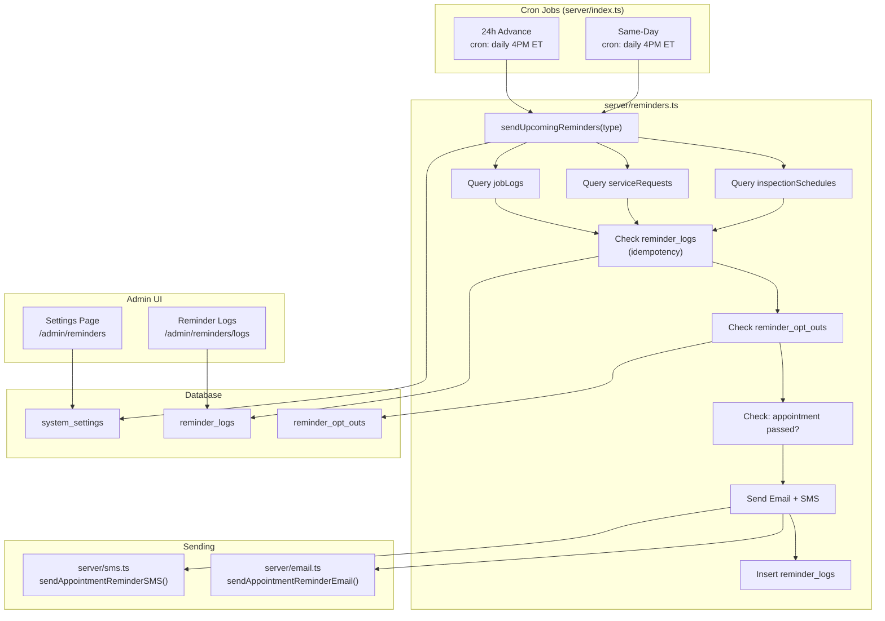

# ADR SC-REMINDERS-001: Automated Appointment Reminders

**Status:** Proposed  
**Date:** 2026-03-09  
**Author:** Akbar (System Architect)  
**Context Doc:** `docs/SC-REMINDERS-001-requirements.md`

---

## Context

AbsolutePestServices.com needs automated appointment reminders to reduce no-shows. Mike confirmed: daily at 4pm (configurable), Email + SMS both, customer opt-out via unsubscribe link, admin settings page, and no reminders sent after an appointment has passed.

This ADR supersedes the Phase 1 email-only scope in the requirements doc — Mike's answers elevate SMS and opt-out to Phase 1.

---

## Decision 1: Cron Timing Strategy

**Decision:** Two cron jobs per day — `24h advance` and `same-day` — both firing at a configurable time (default 4:00 PM Eastern, stored in admin settings).

**Rationale:**
- Mike specified daily at 4pm, overriding the 8 AM / 9 AM defaults in the requirements draft
- Firing at 4 PM gives customers evening awareness before a next-day appointment
- The same 4 PM job handles same-day reminders (catches morning appointments already passed: see Decision 5)

**Cron Expression (UTC-adjusted):**
```
# 4 PM Eastern = 20:00 UTC (EST) / 21:00 UTC (EDT)
# Use admin-configurable time stored in DB, converted at startup
cron.schedule("0 20 * * *", ...)  // default, recalculated on settings change
```

**Window Queries:**
| Reminder Type | Query Window |
|---|---|
| 24h advance | `WHERE date BETWEEN NOW() + 20h AND NOW() + 44h` |
| Same-day | `WHERE DATE(date AT TIME ZONE 'America/New_York') = TODAY(ET)` |

---

## Decision 2: Reminder Channels — Email + SMS

**Decision:** Phase 1 ships both Email (SendGrid) and SMS (Twilio). Both fire for each appointment unless the customer has opted out.

**Email:** Extend existing `server/email.ts` with `sendAppointmentReminderEmail()` following the established pattern (`sendInvoiceOverdueEmail`).

**SMS:** New `server/sms.ts` module using Twilio SDK.

```typescript
// server/sms.ts
export async function sendAppointmentReminderSMS(data: {
  toPhone: string;
  customerName: string;
  serviceType: string;
  appointmentDate: Date;
  appointmentTime?: string;
  address: string;
}): Promise<boolean>
```

**Alternatives Considered:**
- Email-only Phase 1 (from original requirements) — rejected per Mike's answer
- Twilio Notify (multi-channel abstraction) — over-engineered for current scale; raw Twilio SDK preferred

**Phone Number Source:**
| Record Type | Phone Field |
|---|---|
| `inspectionSchedules` | `phone` (needs schema check — may not exist; skip SMS if null) |
| `serviceRequests` | JOIN `users.phone` |
| `jobLogs` | JOIN `clients.phone` |

> ⚠️ **Luke action required:** Confirm phone fields exist or add them before SMS implementation.

---

## Decision 3: Opt-Out Handling

**Decision:** Token-based unsubscribe link in every reminder email/SMS. Customer opt-out is stored in a new `reminder_opt_outs` table. The cron checks this table before sending.

**Why token-based (not admin-only):**  
Mike confirmed customers can unsubscribe. A link in the email is the only self-service path; requiring a phone call is not CAN-SPAM compliant for email.

**Schema:**
```typescript
export const reminderOptOuts = pgTable("reminder_opt_outs", {
  id: serial("id").primaryKey(),
  email: text("email"),           // indexed; null if SMS-only opt-out
  phone: text("phone"),           // indexed; null if email-only opt-out
  token: text("token").notNull().unique(), // UUID v4 used in unsubscribe URL
  optedOutAt: timestamp("opted_out_at").defaultNow().notNull(),
  optOutType: text("opt_out_type").notNull(), // 'email', 'sms', 'all'
});
```

**Unsubscribe Flow:**
1. Each reminder includes: `https://absolutepestservices.com/reminders/unsubscribe?token=<uuid>`
2. `GET /api/reminders/unsubscribe?token=` — no auth required, sets opt-out, renders confirmation page
3. Cron queries `reminderOptOuts` by email/phone before sending; skips if record found

**Admin override:** Admin can delete an opt-out record to re-enable reminders for a customer.

---

## Decision 4: Admin Settings Storage

**Decision:** `system_settings` DB table (key-value), not `.env` variables.

**Rationale:** Mike requested a configurable admin page with toggle, timing, and timezone. These settings must be editable at runtime without a server restart. Environment variables require a deployment cycle to change.

**Schema:**
```typescript
export const systemSettings = pgTable("system_settings", {
  id: serial("id").primaryKey(),
  key: text("key").notNull().unique(),
  value: text("value").notNull(),
  updatedAt: timestamp("updated_at").defaultNow().notNull(),
  updatedBy: integer("updated_by"), // FK to users (admin)
});
```

**Settings Keys:**
| Key | Default | Description |
|---|---|---|
| `reminders_enabled` | `"true"` | Global on/off switch |
| `reminder_time_hour` | `"20"` | UTC hour to fire cron (4 PM ET = 20 UTC) |
| `reminder_timezone` | `"America/New_York"` | Business timezone (display + cron offset calc) |
| `reminder_24h_enabled` | `"true"` | Toggle 24h advance reminder |
| `reminder_same_day_enabled` | `"true"` | Toggle same-day reminder |
| `reminder_email_enabled` | `"true"` | Toggle email channel |
| `reminder_sms_enabled` | `"true"` | Toggle SMS channel |
| `reminder_inspection_enabled` | `"true"` | Per-type filter: inspections |
| `reminder_service_request_enabled` | `"true"` | Per-type filter: service requests |
| `reminder_job_log_enabled` | `"true"` | Per-type filter: job logs |

**Admin API:**
```
GET  /api/admin/reminders/settings      — fetch all settings
PATCH /api/admin/reminders/settings     — update one or more settings
GET  /api/admin/reminders/logs          — view reminder_logs (paginated)
DELETE /api/admin/reminders/logs/:id    — delete log entry (force re-send)
POST /api/admin/reminders/send-now      — manual trigger (bypass idempotency)
GET  /api/admin/reminders/opt-outs      — list opt-outs
DELETE /api/admin/reminders/opt-outs/:id — remove opt-out (re-enable customer)
```

**Cron Reschedule on Settings Change:** When `reminder_time_hour` is updated via PATCH, the server reschedules the cron dynamically using `node-cron`'s `.stop()` + re-register pattern.

---

## Decision 5: Timezone Handling

**Decision:** All appointments stored in UTC (current behavior). Cron fires at UTC time derived from admin-configured business timezone + reminder hour. Email/SMS display times formatted in `America/New_York` (configurable).

**Timezone offset calculation:**
```typescript
import { zonedTimeToUtc } from 'date-fns-tz'; // or use Temporal API

function getCronExpression(hour: number, timezone: string): string {
  // Convert "4 PM America/New_York" to UTC cron expression
  // Handles DST automatically by recalculating at server startup or settings change
  const utcHour = getUTCHourForLocalTime(hour, timezone);
  return `0 ${utcHour} * * *`;
}
```

> ⚠️ DST gap: When clocks spring forward/fall back, the UTC offset changes. The cron expression must be recalculated at DST transition points, or the reminder fires 1 hour off. **Recommendation:** Reschedule cron on server startup daily via a meta-cron at 2 AM UTC, or use a timezone-aware cron library.

**Same-day "appointment passed" guard (Mike's requirement):**  
Before sending any same-day reminder, check if `appointment_datetime < NOW()`. If the appointment is in the past, skip it.

```typescript
if (appointment.datetime < new Date()) {
  console.log(`[Reminder] Skipping past appointment ${appointment.id}`);
  return;
}
```

---

## Decision 6: Idempotency

**Decision:** `reminder_logs` table with unique constraint on `(appointment_type, appointment_id, reminder_type)`. Same as requirements spec — no change.

**Schema (finalized):**
```typescript
export const reminderLogs = pgTable("reminder_logs", {
  id: serial("id").primaryKey(),
  appointmentType: text("appointment_type").notNull(), // 'inspection' | 'service_request' | 'job_log'
  appointmentId: integer("appointment_id").notNull(),
  reminderType: text("reminder_type").notNull(),       // '24h' | 'same_day'
  channel: text("channel").notNull(),                  // 'email' | 'sms'  ← NEW: per-channel tracking
  recipientEmail: text("recipient_email"),
  recipientPhone: text("recipient_phone"),             // NEW: for SMS tracking
  sentAt: timestamp("sent_at").defaultNow().notNull(),
  success: boolean("success").notNull().default(true),
  errorMessage: text("error_message"),
});

// Unique constraint:
// UNIQUE(appointment_type, appointment_id, reminder_type, channel)
```

Note: `channel` added to unique constraint so email + SMS can both be sent for the same appointment without collision.

---

## System Architecture Diagram



---

## New Files

| File | Purpose |
|---|---|
| `server/reminders.ts` | Core orchestration: query, idempotency, opt-out, send |
| `server/sms.ts` | Twilio SMS sending wrapper |

## Modified Files

| File | Changes |
|---|---|
| `server/email.ts` | Add `sendAppointmentReminderEmail()` |
| `server/index.ts` | Register two reminder crons; add dynamic reschedule logic |
| `shared/schema.ts` | Add `reminderLogs`, `reminderOptOuts`, `systemSettings` tables |
| `server/routes.ts` | Add admin reminder endpoints + public unsubscribe endpoint |

---

## Migration Steps

1. `npm run db:push` after schema changes
2. Set Twilio credentials in Replit Secrets: `TWILIO_ACCOUNT_SID`, `TWILIO_AUTH_TOKEN`, `TWILIO_FROM_NUMBER`
3. Seed default `system_settings` rows in migration or startup check
4. Verify phone fields on `inspectionSchedules`, `users`, `clients` — add if missing

---

## Open Questions for Luke

1. **Phone fields:** Do `inspectionSchedules`, `users`, and `clients` tables have `phone` fields? If not, add `phone text` to those tables.
2. **`inspectionSchedules` status values:** Is there a `confirmed`/`approved` status? Should reminders only fire on confirmed inspections, not `pending` requests?
3. **DST handling:** Confirm whether a daily cron reschedule at 2 AM UTC is acceptable, or if a timezone-aware library (`cron-timezone` npm package) is preferred.
4. **Twilio account:** Does Mike have an existing Twilio account, or does one need to be created?

---

## Consequences

**Positive:**
- Reduces no-shows with minimal ongoing maintenance
- Admin has full runtime control without code deploys
- Customer unsubscribe is CAN-SPAM/TCPA compliant
- Idempotency prevents duplicate sends even on retries

**Tradeoffs/Risks:**
- SMS adds Twilio dependency and per-message cost
- Dynamic cron rescheduling is slightly complex — needs care at DST boundaries
- `system_settings` key-value table is flexible but untyped; recommend a typed accessor layer
- Phone number availability across record types is uncertain — Phase 1 SMS may be partial coverage

---

## Related

- `docs/SC-REMINDERS-001-requirements.md` — full requirements
- `docs/adr/SC-INV-001-invoice-lifecycle.md` — prior art for cron + email pattern
- `server/email.ts` — existing SendGrid integration to extend
- `server/index.ts` — existing cron pattern to follow
