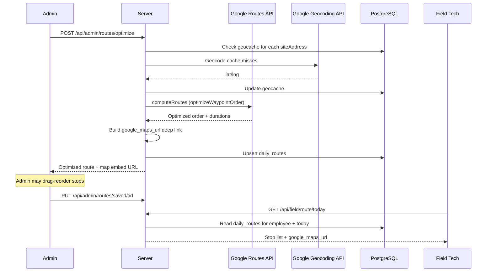

# ADR SC-ROUTE-001: Route Optimization for Field Technicians

**Status:** Proposed  
**Date:** 2026-03-09  
**Author:** Akbar (System Architect)  
**Context Doc:** `docs/SC-ROUTE-001-requirements.md`

---

## Context

Field technicians manually plan their own routes. This feature gives admins a tool to generate an optimized daily route for each technician, and gives field techs a read-only route view accessible from their field portal. Key constraints: Pittsburgh-area roads (time > distance for optimization), typical day has 6–15 stops (within API limits), Google Maps is the natural navigation target for techs.

---

## Decision 1: Optimization Engine — Google Routes API (Server-Side)

**Decision:** Use the **Google Routes API** (`POST /v2/directions:computeRoutes` with `optimizeWaypointOrder: true`) via a server-side call. Never expose the server API key to the client.

**Rationale:**
- Real-time Pittsburgh-area traffic data is superior to any static optimization.
- `optimizeWaypointOrder: true` handles up to 25 intermediate waypoints — sufficient for all realistic routes (6–15 stops typical).
- The tech deep-link output (`maps.google.com/maps/dir/...`) requires zero API key and opens natively in Google Maps on any phone — zero learning curve.
- Routes API replaced the deprecated Directions API (deprecated March 2025) — we build on the current platform from day one.
- Cost at scale: ~5–20 routes/week × $0.014/request ≈ $0–$17/month. Negligible against existing GCP spend.

**Alternatives Considered:**
- **Mapbox Optimization API:** 100k free requests/month is generous. However, techs use Google Maps personally; a Mapbox-rendered map in admin and a Google Maps deep-link for techs creates a fragmented experience. Also adds a second mapping vendor.
- **Simple address sort (no API):** Zero cost, but sorts alphabetically/by zip — meaningless for route efficiency. Not a real optimization.
- **Google Route Optimization API (fleet-scale):** Designed for multi-vehicle fleet routing. More powerful but significantly more complex and expensive. Out of scope for Phase 1 single-tech-per-request use case.

**API Key Security:**
- Server-side key: restricted to server IP. Used for Routes API and Geocoding API calls. Never sent to client.
- Client-side key: restricted by HTTP referrer (`absolutepestservices.com/*`). Used only for Google Maps Embed in admin UI.
- Frontend navigation deep-links require no API key.

**Cost Guard:** Configurable per-day cap (default: 50 optimization requests/day). All API calls logged to a `route_api_log` table. If cap is reached, admin sees a warning and the last saved route is returned instead.

---

## Decision 2: Geocoding — Server-Side with `geocache` Table

**Decision:** Geocode addresses server-side via Google Geocoding API. Cache results in a `geocache` table keyed by normalized address text. Re-geocode only on cache miss or manual invalidation.

**Process:**
1. On route request, check `geocache` for each `siteAddress`.
2. Cache miss → call Google Geocoding API → store `{ address_text, lat, lng, geocoded_at, source }`.
3. Cache hit → use stored coordinates.
4. Geocoding failure → flag the stop for admin with a warning; exclude from optimization; display plaintext address.

**Address fallback priority for `job_logs`:**
```
job_logs.siteAddress → clients.address (via clientId) → manual admin entry
```

**Rationale:**
- Most pest control stops recur at the same addresses (service contracts, repeat customers). Without caching, every route generation re-geocodes the same addresses at $5/1,000. With caching, ongoing geocoding cost approaches zero.
- Keeping geocache as a DB table (not in-memory) means it survives server restarts and is sharable across all route generations.

---

## Decision 3: Route Delivery to Techs — Google Maps Deep Link (No In-App Navigation)

**Decision:** Deliver the optimized route to field techs as a pre-built Google Maps deep link URL. Techs tap it to open Google Maps natively on their phone. No in-app map rendering on the field portal.

**Deep link format:**
```
https://www.google.com/maps/dir/?api=1
  &origin={depotAddress}
  &destination={lastStopAddress}
  &waypoints={stop1}|{stop2}|...|{stopN-1}
  &travelmode=driving
```

URL is pre-built server-side in the optimized stop order and stored in `daily_routes.google_maps_url`.

**Rationale:**
- Zero implementation cost for in-app navigation. Google Maps handles real-time traffic rerouting natively — better than anything we could build.
- Field portal stays simple (mobile-first). No map SDK required on the field side.
- Pre-built URL means the tech can open their route even with intermittent connectivity (URL is already loaded when they viewed the route list).

**Per-stop "Open in Maps" button:** Individual stop links use `https://maps.google.com/?q={address}` — simpler format for single-destination navigation.

---

## Decision 4: Route Storage — `daily_routes` Table (One Row Per Tech Per Day)

**Decision:** Persist the generated optimized route in a `daily_routes` table with `UNIQUE(employee_id, route_date)`. Re-generating a route upserts the existing row.

**Schema:**
```sql
CREATE TABLE daily_routes (
  id SERIAL PRIMARY KEY,
  employee_id INTEGER NOT NULL REFERENCES field_employees(id),
  route_date DATE NOT NULL,
  start_address TEXT,
  optimized_stop_order JSONB NOT NULL,
  -- [{jobLogId, sequence, estimatedArrivalISO, durationSeconds, lat, lng, customerName, address}]
  google_maps_url TEXT,
  total_distance_meters INTEGER,
  total_duration_seconds INTEGER,
  generated_at TIMESTAMP DEFAULT NOW(),
  generated_by INTEGER REFERENCES users(id),
  UNIQUE(employee_id, route_date)
);

CREATE TABLE geocache (
  id SERIAL PRIMARY KEY,
  address_text TEXT NOT NULL UNIQUE,
  lat DECIMAL(10,7),
  lng DECIMAL(10,7),
  geocoded_at TIMESTAMP DEFAULT NOW(),
  source TEXT DEFAULT 'google'
);
```

**`optimized_stop_order` JSONB shape:**
```json
[
  {
    "sequence": 1,
    "jobLogId": 42,
    "customerName": "Smith Residence",
    "address": "123 Oak St, Pittsburgh, PA 15237",
    "estimatedArrival": "2026-03-10T09:15:00-05:00",
    "driveDurationSeconds": 900,
    "lat": 40.5678,
    "lng": -80.0456
  }
]
```

**Rationale:**
- JSONB for the stop array avoids a separate `route_stops` table join on every field tech load.
- `UNIQUE(employee_id, route_date)` allows upsert on regeneration — admin can update the route during the day without creating orphan rows.
- Storing `google_maps_url` pre-built means the field endpoint is a simple DB read, not a URL computation on every tech request.

---

## Decision 5: Admin UI — Embedded Map + Drag-and-Drop Reorder

**Decision:** Admin route planner (`/admin/route-planner`) uses:
- **Google Maps Embed API** (client-side key, referrer-restricted) for the map panel — iframe embed, zero SDK required.
- **`@dnd-kit/core`** (or existing DnD library if one is already in the project) for drag-and-drop stop reorder.
- Manual reorder updates the JSONB array and regenerates the Google Maps URL client-side (no re-call to Routes API).

**Rationale:**
- Maps Embed API is free (vs. Maps JavaScript API which has per-load billing). For a simple "show a route on a map" display in an admin panel, the embed is sufficient.
- Drag-and-drop reorder is a P1 requirement. `@dnd-kit` is lightweight and accessibility-first.

---

## API Surface

```
GET  /api/admin/routes/jobs?employeeId=&date=        → Qualifying job logs with geocode status
POST /api/admin/routes/optimize                       → Generate optimized route (calls Google)
GET  /api/admin/routes/saved?employeeId=&date=        → Load existing route
PUT  /api/admin/routes/saved/:id                      → Save manual reorder
GET  /api/field/route/today                           → Tech's route for today (read-only)
```

All admin endpoints: `requireAdmin`. Field endpoint: `requireFieldAuth`.

---

## Architecture Diagram



---

## Consequences

**Positive:**
- Reduces admin overhead for route planning to a single click.
- Techs navigate via native Google Maps — no new navigation UX to learn.
- Geocache eliminates repeat geocoding costs for recurring addresses.
- Deep link works even with intermittent connectivity on the tech's device.

**Tradeoffs/Risks:**
- **Address data quality is the #1 risk.** `job_logs.siteAddress` is nullable. Missing addresses must be flagged and manually resolved before route generation. Recommend: backfill from `clients.address` where possible.
- Google Maps API key management adds operational overhead (key rotation, quota monitoring).
- Embedded admin map uses an iframe — limited interactivity vs. Maps JavaScript API. Acceptable for Phase 1.
- Routes API is billed per request — the cost guard is mandatory, not optional.

---

## Open Items for Mike

1. ~~What is the depot/starting address?~~ → **Confirmed:** Each employee has their home as depot. Add "depot address" field to employee setup.
2. ~~Does Absolute already have a Google Cloud account / Maps API key?~~ → **Confirmed:** Use placeholder `GOOGLE_MAPS_API_KEY` in `.env`, Mike to fill in.
3. Route sharing method: copyable URL only, or SMS/push to tech? (OQ-3)
4. When a tech marks a stop "Done" from route view, should it trigger the full job log flow (photos, notes) or just flip status? (OQ-7)

---

## Related

- `docs/SC-ROUTE-001-requirements.md`
- `shared/schema.ts` — `job_logs`, `field_employees`, `clients`
- `ARCHITECTURE.md`
