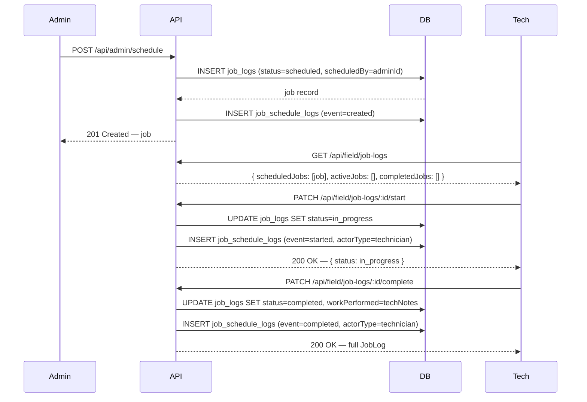
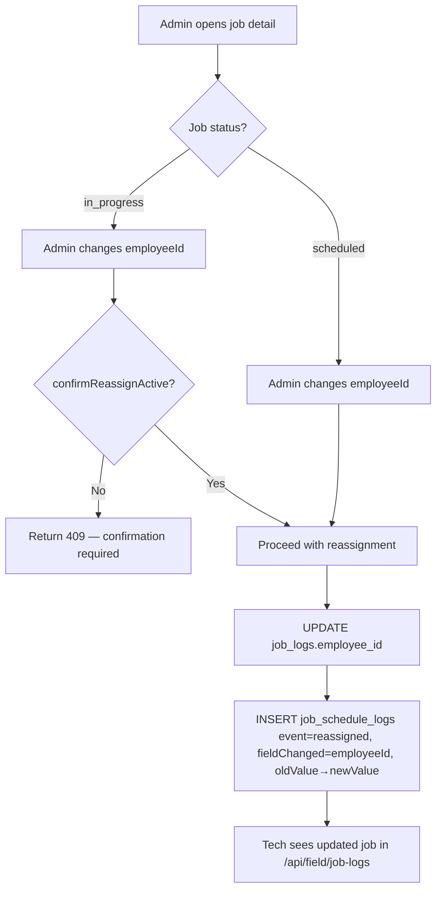
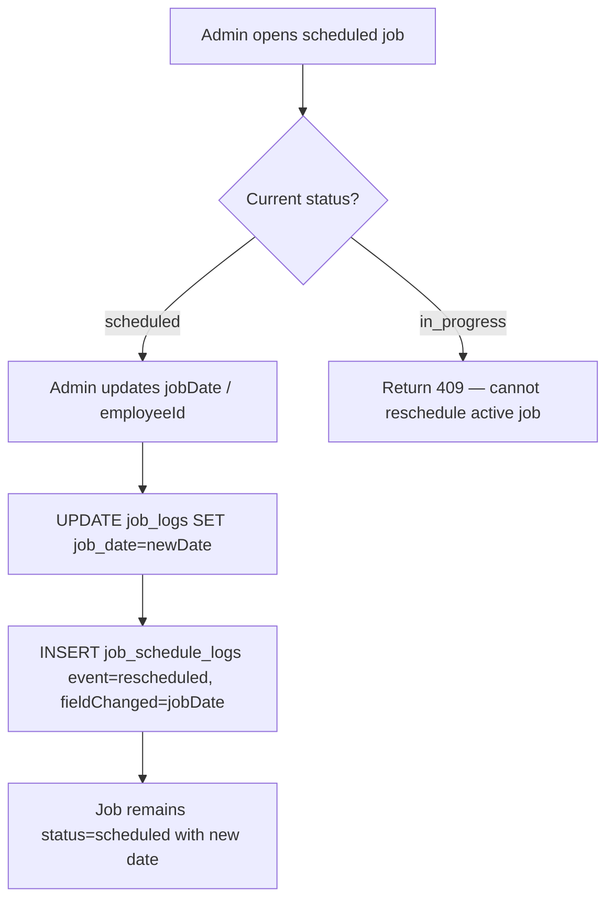
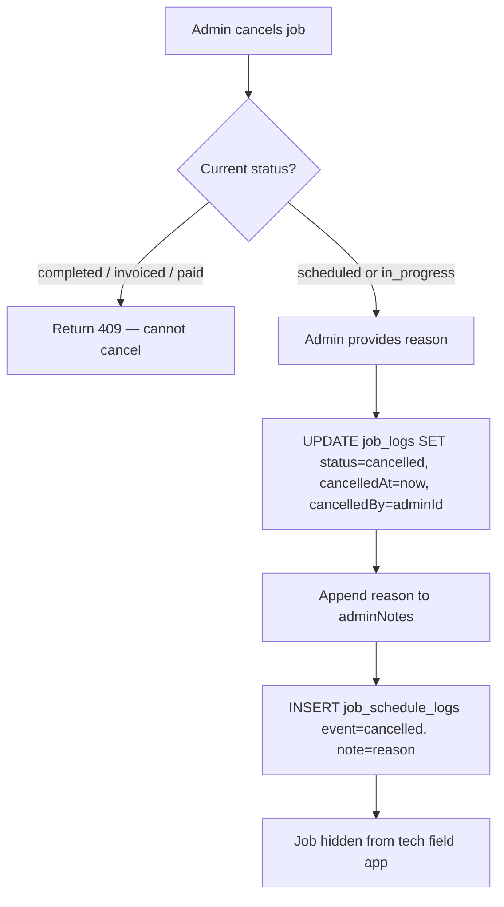

# ADR SC-SCHEDULING-001: Admin Job Scheduling

**Status:** Proposed
**Date:** 2026-03-09
**Author:** Akbar (System Architect)
**Context Doc:** `docs/SC-SCHEDULING-001-requirements.md`

---

## Context

Absolute Pest Services field operations currently have no pre-work scheduling layer. Technicians create job logs **after** completing work, setting `employeeId` themselves at submission time. Admin has no mechanism to pre-create a job, pre-assign a technician, or give a tech a "to-do" list before arriving on site.

This feature adds a **scheduling lifecycle** on top of the existing `job_logs` table: admin creates a job in `scheduled` state, assigns it to a technician, and the tech sees it in the field app before the visit. The tech starts the job (→ `in_progress`) and completes it (→ `completed`), at which point the standard invoice flow picks up unchanged.

The stack is TypeScript, Express, Drizzle ORM, PostgreSQL (Neon), React + Vite.

---

## Decision 1: Extend `job_logs` — Do Not Create a Separate `scheduled_jobs` Table

**Decision:** Add scheduling columns to the existing `job_logs` table rather than creating a parallel `scheduled_jobs` table that later merges into `job_logs`.

**Rationale:**

- `job_logs.status` already has `'scheduled'` as a valid value — the table conceptually owns the full job lifecycle.
- A separate table would require a "promote to job_log" migration step and risk data divergence / orphan records.
- All downstream systems (invoices, reminders, route optimization, time tracking) already reference `job_logs.id` — keeping a single table preserves those FK relationships at no cost.
- The six new columns (`scheduledBy`, `scheduledEndTime`, `adminNotes`, `priority`, `cancelledAt`, `cancelledBy`) are nullable or have defaults, making the migration safe and non-breaking.
- Precedent: `SC-INV-001` and `SC-TIME-001` both extend existing tables with additive nullable columns rather than introducing parallel tables.

**Alternatives Considered:**

| Option | Pros | Cons |
|--------|------|------|
| Separate `scheduled_jobs` table | Clean separation of pre/post-work data | FK complexity; "promote" step; duplicates job data; breaks existing integrations |
| JSONB `metadata` column for scheduling fields | Zero migration risk | Unqueryable, unindexable; hidden schema; breaks type safety |
| **Extend `job_logs` (chosen)** | Single source of truth; FK integrity; no data migration; consistent with codebase patterns | Minor schema widening; nullable columns need documentation |

---

## Decision 2: New Table `job_schedule_logs` for Audit Trail

**Decision:** Create a dedicated `job_schedule_logs` table to record every state transition and field change on a scheduled job.

**Rationale:**

- Audit trail must be append-only (never updated or deleted). A separate table enforces this more cleanly than adding audit columns to `job_logs`.
- Follows the `invoice_status_logs` pattern already in the codebase (same `fromStatus → toStatus`, `actorId`, `createdAt` shape).
- Query pattern (fetch all events for a job) is a simple FK lookup, efficient with an index on `job_log_id`.

**Alternatives Considered:**

| Option | Pros | Cons |
|--------|------|------|
| `notes` column on `job_logs` | Simple | Not structured; cannot filter or query events |
| JSONB history array on `job_logs` | Single row | Append-only not enforceable; no FK actors; hard to query individual events |
| **`job_schedule_logs` table (chosen)** | Structured, append-only, queryable, consistent with `invoice_status_logs` | Extra table; minor join overhead |

---

## Decision 3: Status State Machine — Enforce at Application Layer

**Decision:** Status transitions are validated in `server/storage.ts` (or a dedicated `scheduling.service.ts`) before any DB write, not via database constraints.

**Allowed transitions:**

| From | To | Actor |
|------|----|-------|
| `scheduled` | `in_progress` | Technician |
| `scheduled` | `cancelled` | Admin |
| `scheduled` | `scheduled` | Admin (reschedule — same status, updated fields) |
| `in_progress` | `completed` | Technician |
| `in_progress` | `scheduled` | Admin (un-start / mistake correction) |
| `in_progress` | `cancelled` | Admin |
| `completed` | `invoiced` | Admin (via SC-INV-001) |
| `invoiced` | `paid` | Admin (via SC-INV-001) |

**Invalid transitions (must return HTTP 422):**
- Any tech action on a job not assigned to them
- Any state change on `completed`, `invoiced`, or `paid` jobs (except invoice progression)
- Cancellation of `completed`, `invoiced`, or `paid` jobs

**Rationale:** Consistent with `SC-TIME-001` shift state management and `SC-INV-001` invoice status progression — application-layer validation is testable and visible in code review. PostgreSQL check constraints could be added later if needed.

---

## Schema Changes

### 1. Extend `job_logs` Table

Add 6 new columns. All are nullable (or have safe defaults) — zero impact on existing records or the field log submission flow.

```typescript
// shared/schema.ts — extend jobLogs pgTable definition
scheduledBy: integer("scheduled_by").references(() => users.id),
// Admin user who created the scheduled entry.
// NULL on records created by techs (existing manual flow).

scheduledEndTime: timestamp("scheduled_end_time"),
// Optional end of the scheduled time window.
// NULL when not specified (point-in-time job).

adminNotes: text("admin_notes"),
// Internal admin notes visible only in admin portal.
// Not shown to technicians in the field app.

priority: text("priority").notNull().default("medium"),
// Dispatch priority: 'low' | 'medium' | 'high' | 'urgent'
// Default 'medium' is safe for all existing records.

cancelledAt: timestamp("cancelled_at"),
// Timestamp of cancellation. NULL unless status = 'cancelled'.

cancelledBy: integer("cancelled_by").references(() => users.id),
// Admin who cancelled the job. NULL unless cancelled.
```

**Migration notes:**
- `priority` is `notNull().default("medium")` — safe backfill for all existing rows.
- All other columns are nullable — no backfill needed.
- Run `npm run db:push` after editing `shared/schema.ts`.
- No changes to existing indexes required; add `idx_job_logs_scheduled_by` and `idx_job_logs_status_job_date` for scheduling list query performance.

**Recommended new indexes:**
```sql
-- Support admin scheduling list: filter by status + sort by date
CREATE INDEX idx_job_logs_status_job_date ON job_logs (status, job_date);

-- Support tech field app: fetch jobs by assigned employee + status
CREATE INDEX idx_job_logs_employee_status ON job_logs (employee_id, status);
```

---

### 2. New Table: `job_schedule_logs` (Audit Trail)

```typescript
// shared/schema.ts — new table
export const jobScheduleLogs = pgTable("job_schedule_logs", {
  id: serial("id").primaryKey(),

  jobLogId: integer("job_log_id")
    .notNull()
    .references(() => jobLogs.id, { onDelete: "cascade" }),
  // Cascade delete: if a job_log is hard-deleted, audit trail goes with it.
  // Note: job_logs should only be soft-deleted in practice.

  actorId: integer("actor_id"),
  // users.id for admin actions; fieldEmployees.id for tech actions; NULL for system actions.

  actorType: text("actor_type").notNull(),
  // 'admin' | 'technician' | 'system'

  event: text("event").notNull(),
  // 'created' | 'assigned' | 'reassigned' | 'rescheduled' |
  // 'cancelled' | 'started' | 'completed' | 'field_updated'

  fieldChanged: text("field_changed"),
  // Which field was changed, e.g. 'employeeId', 'jobDate', 'status'.
  // NULL for 'created' events.

  oldValue: text("old_value"),
  // Serialized previous value. NULL for 'created' events.

  newValue: text("new_value"),
  // Serialized new value.

  note: text("note"),
  // Free-text context, e.g. cancellation reason.

  createdAt: timestamp("created_at").defaultNow().notNull(),
});

// Insert schema (audit entries are never updated)
export const insertJobScheduleLogSchema = createInsertSchema(jobScheduleLogs).omit({
  id: true,
  createdAt: true,
});

// Types
export type JobScheduleLog = typeof jobScheduleLogs.$inferSelect;
export type InsertJobScheduleLog = z.infer<typeof insertJobScheduleLogSchema>;
```

**Index:**
```sql
CREATE INDEX idx_job_schedule_logs_job_log_id ON job_schedule_logs (job_log_id);
```

---

## API Contract

All admin scheduling endpoints require the `requireAdmin` middleware. Field endpoints require `requireFieldAuth` and enforce ownership (`job.employeeId === session.fieldEmployeeId`).

### Admin Endpoints

#### `GET /api/admin/schedule`
List scheduled jobs with optional filters.

**Query Parameters:**
```
employeeId?   integer    Filter by technician
status?       string     Filter by status (scheduled|in_progress|completed|cancelled)
dateFrom?     string     ISO 8601 date — start of range (inclusive)
dateTo?       string     ISO 8601 date — end of range (inclusive)
```

**Response `200 OK`:**
```typescript
{
  jobs: Array<{
    id: number;
    status: 'scheduled' | 'in_progress' | 'completed' | 'cancelled' | 'invoiced' | 'paid';
    jobDate: string;             // ISO 8601
    scheduledEndTime: string | null;
    employeeId: number;
    employeeName: string;        // joined from field_employees
    clientId: number | null;
    customerName: string;
    siteLocation: string;
    siteAddress: string | null;
    workPerformed: string;
    priority: 'low' | 'medium' | 'high' | 'urgent';
    adminNotes: string | null;
    scheduledBy: number | null;
    createdAt: string;
  }>;
  total: number;
}
```

---

#### `POST /api/admin/schedule`
Create a new scheduled job. Sets `status = 'scheduled'` and records a `created` audit entry.

**Request Body:**
```typescript
{
  employeeId: number;          // required — must be active field employee
  clientId: number;            // required — must exist in clients table
  customerName?: string;       // optional override; defaults to client.name
  jobDate: string;             // required — ISO 8601 datetime
  scheduledEndTime?: string;   // optional — ISO 8601 datetime
  siteLocation: string;        // required
  siteAddress?: string;        // recommended for SC-ROUTE-001
  servicedArea?: string;
  workPerformed: string;       // required — job instructions for tech
  priority?: 'low' | 'medium' | 'high' | 'urgent';  // default: 'medium'
  adminNotes?: string;
}
```

**Response `201 Created`:**
```typescript
{
  id: number;
  status: 'scheduled';
  employeeId: number;
  employeeName: string;
  clientId: number;
  clientName: string;
  customerName: string;
  jobDate: string;
  scheduledEndTime: string | null;
  siteLocation: string;
  siteAddress: string | null;
  servicedArea: string | null;
  workPerformed: string;
  priority: string;
  adminNotes: string | null;
  scheduledBy: number;
  createdAt: string;
}
```

**Validation errors `422 Unprocessable Entity`:**
- `employeeId` references an inactive or non-existent employee
- `clientId` does not exist
- `jobDate` is missing or invalid

---

#### `GET /api/admin/schedule/stats`
Dashboard counts for the current day (or supplied date).

**Query Parameters:**
```
date?   string   ISO 8601 date, defaults to today
```

**Response `200 OK`:**
```typescript
{
  scheduled: number;
  in_progress: number;
  completed: number;
  cancelled: number;
}
```

---

#### `GET /api/admin/schedule/:id`
Retrieve a single job with its full audit trail.

**Response `200 OK`:**
```typescript
{
  job: JobLog;   // full job_logs row including all scheduling columns
  auditLog: Array<{
    id: number;
    event: string;
    actorType: 'admin' | 'technician' | 'system';
    actorId: number | null;
    actorName: string | null;  // joined from users or field_employees
    fieldChanged: string | null;
    oldValue: string | null;
    newValue: string | null;
    note: string | null;
    createdAt: string;
  }>;
}
```

---

#### `PATCH /api/admin/schedule/:id`
Update a scheduled job — reassign technician, reschedule date, or update other fields.

**Business rules:**
- Only allowed on jobs in `scheduled` or `in_progress` status.
- `employeeId` changes on `in_progress` jobs succeed (reassignment), but require a confirmation flag in the request body (`confirmReassignActive: true`).
- `jobDate` changes are only allowed on `scheduled` jobs (not `in_progress`).
- Each changed field writes a separate `job_schedule_logs` entry.

**Request Body:**
```typescript
{
  employeeId?: number;
  jobDate?: string;                // Only valid when status = 'scheduled'
  scheduledEndTime?: string;
  siteLocation?: string;
  siteAddress?: string;
  workPerformed?: string;
  adminNotes?: string;
  priority?: 'low' | 'medium' | 'high' | 'urgent';
  confirmReassignActive?: boolean; // Required when reassigning an in_progress job
}
```

**Response `200 OK`:** Updated `JobLog` object (same shape as POST response).

**Errors:**
- `404` — job not found
- `409 Conflict` — attempting to reschedule an `in_progress` job's date
- `409 Conflict` — reassigning `in_progress` job without `confirmReassignActive: true`
- `422` — invalid field values

---

#### `PATCH /api/admin/schedule/:id/cancel`
Cancel a job. Only allowed on `scheduled` or `in_progress` jobs.

**Request Body:**
```typescript
{
  reason: string;  // required — stored in job_schedule_logs.note and job_logs.adminNotes
}
```

**Response `200 OK`:**
```typescript
{
  id: number;
  status: 'cancelled';
  cancelledAt: string;
  cancelledBy: number;
}
```

**Errors:**
- `409 Conflict` — job is `completed`, `invoiced`, or `paid` (cannot cancel)
- `422` — `reason` is missing or empty

---

### Field (Technician) Endpoints

#### `GET /api/field/job-logs` — Extended Response Shape

Existing endpoint is extended to segregate jobs by state. Existing callers that only read `completedJobs` are unaffected.

**Response `200 OK`:**
```typescript
{
  scheduledJobs: JobLog[];   // status = 'scheduled', assigned to this tech, sorted by jobDate asc
  activeJobs: JobLog[];      // status = 'in_progress', assigned to this tech
  completedJobs: JobLog[];   // status = 'completed' (existing — today's completed logs)
}
```

---

#### `PATCH /api/field/job-logs/:id/start`
Tech starts an assigned job. Transitions `scheduled → in_progress`.

**Business rules:**
- Job must be in `scheduled` status.
- `job.employeeId` must equal the authenticated technician's `fieldEmployeeId`.
- Writes `started` event to `job_schedule_logs`.
- If `SC-TIME-001` is active: optionally auto-creates a `shift_time_blocks` entry with `blockType = 'job'` and `jobLogId` set.

**Request Body:** _(none required)_

**Response `200 OK`:**
```typescript
{
  id: number;
  status: 'in_progress';
  startedAt: string;  // server timestamp (stored in job_schedule_logs.createdAt for the 'started' event)
}
```

**Errors:**
- `403 Forbidden` — job not assigned to this tech
- `409 Conflict` — job not in `scheduled` status

---

#### `PATCH /api/field/job-logs/:id/complete`
Tech completes a job. Transitions `in_progress → completed`. Accepts full job log payload (tech notes, custom fields). This is the bridge between the pre-scheduled job and the completed log.

**Business rules:**
- Job must be in `in_progress` status.
- `job.employeeId` must equal the authenticated technician's `fieldEmployeeId`.
- Writes `completed` event to `job_schedule_logs`.
- `workPerformed` in this payload **overrides** the admin-set instructions with the tech's actual work notes. The original admin instructions are preserved in `adminNotes`.

**Request Body:**
```typescript
{
  workPerformed: string;       // required — tech's actual notes on work done
  customFields?: Record<string, unknown>;
  // Photo uploads are handled via existing /api/field/job-logs/:id/photos endpoint
}
```

**Response `200 OK`:** Full updated `JobLog` object with `status = 'completed'`.

**Errors:**
- `403 Forbidden` — job not assigned to this tech
- `409 Conflict` — job not in `in_progress` status

---

## Workflow Diagrams

### Create & Execute Flow



---

### Assign / Reassign Flow



---

### Reschedule Flow



---

### Cancel Flow



---

## `IStorage` Interface Changes

Add these methods to `server/storage.ts`:

```typescript
// Scheduling — Admin
createScheduledJob(data: InsertJobLog, adminId: number): Promise<JobLog>;
getScheduledJobs(filters: {
  employeeId?: number;
  status?: string | string[];
  dateFrom?: Date;
  dateTo?: Date;
}): Promise<JobLog[]>;
getScheduledJobById(id: number): Promise<JobLog | undefined>;
updateScheduledJob(id: number, data: Partial<InsertJobLog>, adminId: number): Promise<JobLog>;
cancelScheduledJob(id: number, reason: string, adminId: number): Promise<JobLog>;
getSchedulingStats(date: Date): Promise<{ scheduled: number; in_progress: number; completed: number; cancelled: number }>;

// Scheduling — Field Technician
getJobsForTech(employeeId: number): Promise<{ scheduledJobs: JobLog[]; activeJobs: JobLog[] }>;
startJob(jobLogId: number, employeeId: number): Promise<JobLog>;
completeJob(jobLogId: number, employeeId: number, data: { workPerformed: string; customFields?: Record<string, unknown> }): Promise<JobLog>;

// Audit Trail
createJobScheduleLog(data: InsertJobScheduleLog): Promise<JobScheduleLog>;
getJobScheduleLogs(jobLogId: number): Promise<JobScheduleLog[]>;
```

---

## Security

| Concern | Control |
|---------|---------|
| Admin endpoint access | `requireAdmin` middleware on all `/api/admin/schedule/*` routes |
| Tech ownership enforcement | `job.employeeId === session.fieldEmployeeId` validated server-side before start/complete |
| Audit log integrity | No `UPDATE` or `DELETE` on `job_schedule_logs` — insert-only by design |
| Admin notes confidentiality | `adminNotes` excluded from `GET /api/field/job-logs` response payload |
| Invalid status transitions | 422/409 returned server-side; client cannot bypass via direct API calls |

---

## Integration Points

| System | Touch Point |
|--------|-------------|
| **SC-ROUTE-001** | `GET /api/admin/schedule?status=scheduled&date=today` feeds the route optimizer. `siteAddress` is required for geocoding — enforce at job creation. |
| **SC-INV-001** | `completed` jobs are eligible for invoice creation via existing `POST /api/admin/invoices` with `jobLogId`. No change needed. |
| **SC-REMINDERS-001** | Scheduled jobs with a future `jobDate` and a `clientId` with contact info trigger the reminder system. Query: `status = 'scheduled' AND job_date BETWEEN now() AND now() + 25h`. |
| **SC-TIME-001** | `PATCH /api/field/job-logs/:id/start` optionally auto-opens a `shift_time_blocks` entry. Optional in Phase 1 — coordinate with Luke during implementation. |

---

## Non-Functional Decisions

### Performance
- Scheduling list (admin, 50 jobs/day): the composite index `(status, job_date)` ensures the query runs via index scan, not full table scan. Estimated query time < 50ms at current data volumes.
- Tech "My Jobs" fetch: index on `(employee_id, status)` ensures O(assigned jobs) not O(all jobs).

### Backward Compatibility
- `POST /api/field/job-logs` (manual tech submission) is untouched. Scheduling is additive.
- `job_logs` records created by techs manually will have `scheduledBy = NULL`, `priority = 'medium'` (default), all new columns NULL or defaulted. Existing queries are unaffected.
- `status` default on `job_logs` remains `'completed'` for manual tech submissions.

### Data Integrity
- `cancelledAt` / `cancelledBy` are only meaningful when `status = 'cancelled'`. Application layer enforces this; no DB constraint needed in Phase 1.
- Client soft-delete: if a `clients` record is deleted, `job_logs.clientId` FK becomes stale. NFR-005 requires displaying a fallback `customerName` — the denormalized `job_logs.customerName` field handles this gracefully.

---

## Open Risks

| Risk | Likelihood | Impact | Mitigation |
|------|-----------|--------|------------|
| `in_progress` job rescheduling blocked — admin needs escape hatch | Medium | Medium | Admin can un-start (`in_progress → scheduled`) then reschedule. Document this flow for admin training. |
| Tech starts wrong job (wrong `employeeId`) | Low | Medium | NFR-004: server-enforced ownership check. Admin can un-start and reassign. |
| Service contract auto-scheduling (Phase 2) may generate duplicate `scheduled` records if admin already created manually | Medium | Low | `service_contracts.lastGeneratedJobDate` prevents re-generation. Phase 2 should check for existing `scheduled` jobs in the same date window before auto-creating. |
| `adminNotes` leaking to tech app | Low | Medium | Explicitly exclude from tech API response. Code review checkpoint. |
| OQ-9: No conflict detection for double-booking | Known gap | Low (Phase 1) | Out of scope. Admin must visually check calendar. Add scheduling conflict detection in Phase 2. |

---

## Implementation Order (for Luke)

1. **Schema** — Edit `shared/schema.ts`: add 6 columns to `jobLogs`, add `jobScheduleLogs` table, insert schema, and types. Run `npm run db:push`.
2. **Storage layer** — Add all new methods to `IStorage` and `DatabaseStorage` in `server/storage.ts`.
3. **Admin routes** — Add `/api/admin/schedule` route group in `server/routes.ts` with `requireAdmin` middleware.
4. **Field routes** — Add `start` and `complete` PATCH endpoints; extend `GET /api/field/job-logs` response.
5. **Admin UI** — `/admin/scheduling` page: list view with filters, create form, detail/edit drawer.
6. **Field app UI** — "My Jobs" home screen showing `scheduledJobs` and `activeJobs`; Start Job / Complete Job buttons.
7. **Integration wiring** — Hook `start` into SC-TIME-001 time blocks (optional, coordinate with Luke).

---

## Related ADRs / Documents

- `docs/SC-SCHEDULING-001-requirements.md` — Feature requirements (3CP0)
- `docs/adr/SC-INV-001-invoice-lifecycle.md` — Invoice lifecycle (completed jobs feed here)
- `docs/adr/SC-ROUTE-001-architecture.md` — Route optimization (scheduled jobs are primary input)
- `docs/adr/SC-REMINDERS-001-architecture.md` — Customer reminders (triggered by scheduled jobs)
- `docs/adr/SC-TIME-001-architecture.md` — Time tracking (start job can auto-open time block)

---

## Revision History

| Version | Date | Author | Notes |
|---------|------|--------|-------|
| 0.1 | 2026-03-09 | Akbar | Initial ADR |
