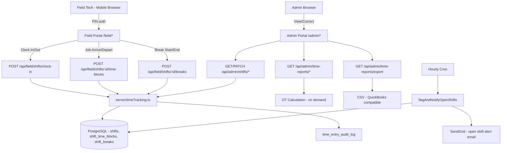

# ADR SC-TIME-001: Field Technician Time Tracking

**Status:** Proposed  
**Date:** 2026-03-09  
**Author:** Akbar (System Architect)  
**Context Doc:** `docs/SC-TIME-001-requirements.md`

---

## Context

Absolute Pest Services has no current shift or time tracking system. Field technicians (hourly, FLSA non-exempt) clock in/out manually or on paper. This feature adds digital time tracking to the field portal: shift clock in/out, per-job time blocks, break tracking, admin correction with audit log, overtime calculation, and CSV payroll export. The stack is TypeScript, Express, Drizzle ORM, PostgreSQL (Neon), React + Vite.

---

## Decision 1: Data Model — Four New Tables, App-Layer Computed Fields

**Decision:** Four new tables: `shifts`, `shift_time_blocks`, `shift_breaks`, `time_entry_audit_log`. All computed duration fields (`total_shift_minutes`, `duration_minutes`, `break_minutes`) are calculated in the application layer on clock-out/end events — NOT via database triggers or generated columns.

**Rationale:**
- Neon (serverless PostgreSQL) supports triggers, but using DB triggers for business logic complicates migrations, makes the logic invisible to application code, and conflicts with the project's established pattern of keeping business logic in `server/storage.ts`.
- App-layer computation is testable with unit tests and transparent in code review.
- Computed values are stored after calculation (not recalculated on every read) — consistent with how `reminder_logs` and `invoice` computations work in this codebase.

**Schema summary:**

```typescript
// shifts — one row per work shift
shifts: {
  id, employeeId, clockInAt, clockOutAt,
  clockInGps, clockOutGps,        // jsonb: {lat, lng, accuracy, status}
  clockInNotes, clockOutNotes,
  totalShiftMinutes,               // computed on clock-out: clockOut - clockIn - unpaidBreaks
  status: "open" | "closed" | "flagged",
  createdAt, updatedAt
}

// shift_time_blocks — job/travel time within a shift
shift_time_blocks: {
  id, shiftId, employeeId,         // employeeId denormalized for query efficiency
  blockType: "job" | "travel" | "admin",
  jobLogId,                        // nullable; required when blockType = "job"
  startedAt, endedAt,
  durationMinutes,                 // computed on end
  arrivalGps, departureGps,
  notes, createdAt
}

// shift_breaks — break periods within a shift
shift_breaks: {
  id, shiftId, employeeId,
  breakType: "rest" | "meal",
  isPaid,                          // stored at creation from config; not recomputed later
  breakStartAt, breakEndAt,
  breakMinutes,                    // computed on end
  notes, createdAt
}

// time_entry_audit_log — immutable admin correction log
time_entry_audit_log: {
  id, entityType, entityId,
  actorId, actorType: "admin" | "employee" | "system",
  fieldChanged, oldValue, newValue,
  reason, correctedAt
}
```

**Indexes:**
```sql
CREATE INDEX ON shifts(employee_id);
CREATE INDEX ON shifts(clock_in_at);
CREATE INDEX ON shifts(status) WHERE status = 'open';
CREATE INDEX ON shift_time_blocks(shift_id);
CREATE INDEX ON shift_breaks(shift_id);
```

**`isPaid` stored at break creation:** Break pay configuration can change over time. Storing `isPaid` as a snapshot at break creation time ensures historical records remain accurate even if the admin changes break policy later.

---

## Decision 2: Business Logic Constraints — Application Layer Enforcement

**Decision:** All state machine constraints are enforced in `server/routes.ts` (or a dedicated `server/timeTracking.ts` service module) before any DB write. The DB provides FK integrity only.

**Constraints enforced at API layer:**
1. **One open shift per employee:** `SELECT id FROM shifts WHERE employee_id = ? AND status = 'open' LIMIT 1` — reject clock-in if found.
2. **One active break per shift:** `SELECT id FROM shift_breaks WHERE shift_id = ? AND break_end_at IS NULL LIMIT 1` — reject new break if found.
3. **Block-out clock on active break:** Before clock-out, verify no open break. Return 400 with message "End your break before clocking out."
4. **Time blocks within shift window:** `startedAt >= shift.clockInAt`. Enforced server-side.
5. **No overlapping time blocks within a shift:** Check for existing open or overlapping blocks before inserting.

**Rationale:** Centralizing these in the service layer keeps them testable, visible, and consistent. DB CHECK constraints for temporal overlap would be complex to write and harder to return helpful error messages from.

---

## Decision 3: Overtime Calculation — Weekly, FLSA-Standard, Informational in v1

**Decision:** Calculate overtime as `max(0, total_week_minutes / 60 - 40)` hours, aggregated per calendar workweek. Workweek start day is configurable (default: Monday). Results are **informational only** in v1 — no dollar calculations, no payroll push.

**Calculation location:** Computed on-demand in the `GET /api/admin/time-reports/summary` endpoint — not stored as a column. The query aggregates `totalShiftMinutes` across all closed shifts in the workweek, applies the 40-hour threshold.

**Workweek boundary query pattern:**
```sql
SELECT SUM(total_shift_minutes) as week_minutes
FROM shifts
WHERE employee_id = ?
  AND status = 'closed'
  AND clock_in_at >= :weekStart
  AND clock_in_at < :weekEnd
```

Where `weekStart` and `weekEnd` are calculated in the app layer based on the admin-configured workweek start day, in America/New_York timezone.

**Timezone handling:** All timestamps stored in UTC. All overtime boundary calculations performed in `America/New_York` using `date-fns-tz` (already in project if SC-REMINDERS-001 was implemented) or `luxon`.

**Rationale:**
- Pennsylvania has no daily OT requirement; FLSA weekly threshold is the only applicable rule.
- Storing computed OT as a column introduces stale data risk (if shift corrections are made). On-demand calculation is always accurate.
- Informational v1 keeps legal liability with the payroll provider where it belongs.

---

## Decision 4: GPS — Best-Effort, Non-Blocking

**Decision:** GPS capture via browser `navigator.geolocation` is attempted at every punch event (clock in/out, job arrival/departure). The punch **always succeeds** regardless of GPS outcome. GPS status is stored as one of: `captured`, `denied`, `timeout`.

**Timeout:** 5 seconds. If GPS hasn't resolved in 5 seconds, punch proceeds with `{ status: "timeout" }`.

**Storage:** GPS data stored as JSONB column on `shifts` and `shift_time_blocks` rows. No separate table.

**Geofencing deferred to v2.** No location-based blocking or enforcement in v1.

**Rationale:**
- Blocking punches on GPS failure would cause severe UX issues in crawl spaces, basements, and metal buildings — exactly where these techs work.
- JSONB avoids a separate GPS table join for the common case (just reading shift data).
- Browser Geolocation API requires HTTPS and user permission — both are already required/expected in production.

---

## Decision 5: Admin Corrections — Audit Log, Not Soft Delete

**Decision:** Admin edits to any time record (shift, block, break) are applied directly to the record AND written to `time_entry_audit_log`. Records are never soft-deleted — corrections are always append-to-audit + update-in-place.

**`time_entry_audit_log` is immutable:** No DELETE or UPDATE is permitted on audit rows. Enforced by removing the DELETE route for that table and by admin policy.

**Edit flow:**
```
PATCH /api/admin/shifts/:id
  → validate new values (times within reasonable bounds)
  → write audit row: {entityType: "shift", entityId, actorId, fieldChanged, oldValue, newValue, reason}
  → update shifts row
  → recompute totalShiftMinutes if clock times changed
```

**Rationale:**
- FLSA requires recordkeeping of time records and corrections. A full audit trail is a compliance requirement, not a nice-to-have.
- Soft delete (adding `deleted_at`) adds query complexity everywhere. Direct update + audit log is simpler and more transparent.
- Audit log immutability is enforced at the API layer (no DELETE endpoint for `time_entry_audit_log`).

---

## Decision 6: Payroll Export — CSV Only in v1, QuickBooks-Compatible First

**Decision:** v1 ships a single CSV export format designed to be importable into QuickBooks Time. Export triggered manually by admin. Webhook/API push deferred to v2.

**CSV columns (QuickBooks Time compatible):**
```
Employee Name, Employee ID (external_payroll_id), Period Start, Period End,
Regular Hours, Overtime Hours, Total Hours, Break Minutes (unpaid)
```

**Export endpoint:** `GET /api/admin/time-reports/export?startDate=&endDate=&employeeIds=`

**`field_employees` additions:**
- `hourly_rate DECIMAL(10,2)` — optional, for future dollar calculations
- `external_payroll_id TEXT` — maps to QuickBooks/ADP employee record

**Rationale:**
- Mike needs to confirm payroll system (QuickBooks, ADP, Gusto — OQ-5). QuickBooks is the most common for SMBs of this size.
- Building a generic CSV that is _also_ QuickBooks-compatible covers the base case while remaining flexible.
- v2 timesheet approval workflow (pending → approved → exported status) is straightforward to add on top of this foundation.

---

## Decision 7: Open Shift Detection — Flagging + Admin Email

**Decision:** A scheduled check (added to the existing hourly cron) flags any shift open for > `N` hours (default: 14 hours) by setting `shifts.status = 'flagged'`. Admin is notified via email using the existing SendGrid pattern.

```typescript
// Add to hourly cron in server/index.ts
cron.schedule("0 * * * *", async () => {
  await flagAndNotifyOpenShifts(); // in server/timeTracking.ts
});
```

**Notification:** Single email to `rob@absolutepestservices.com` listing all newly flagged open shifts. Uses existing `sendEmail()` from `server/email.ts`.

**Rationale:** Unclosed shifts silently inflate overtime calculations. Flagging and notifying ensures admin awareness without auto-closing (which could create inaccurate records).

---

## New Module: `server/timeTracking.ts`

Primary service module for all time tracking logic:
- `clockIn(employeeId, gps?)` — validates no open shift, creates shift row
- `clockOut(employeeId, gps?, notes?)` — closes shift, computes `totalShiftMinutes`
- `startTimeBlock(shiftId, jobLogId?, blockType, gps?)` — validates shift open, creates block
- `endTimeBlock(blockId, gps?)` — closes block, computes `durationMinutes`
- `startBreak(shiftId, breakType)` — validates shift open, no active break, creates break
- `endBreak(breakId)` — closes break, computes `breakMinutes`
- `flagAndNotifyOpenShifts()` — cron job handler
- `getWeeklyOvertimeSummary(employeeId, weekStart, weekEnd)` — OT calculation
- `applyAdminCorrection(entityType, entityId, changes, adminId, reason?)` — edit + audit

---

## Architecture Diagram



---

## Consequences

**Positive:**
- Complete audit trail satisfies FLSA recordkeeping requirements.
- Overtime calculation is always accurate (on-demand, not stale).
- GPS best-effort prevents punch failures in poor-signal locations.
- Builds payroll export foundation — v2 approval workflow drops in cleanly.

**Tradeoffs/Risks:**
- `time_entry_audit_log` grows unbounded. Plan a retention policy (e.g., archive after 7 years per FLSA) in v2.
- On-demand OT calculation for large date ranges with many employees may be slow. Add `created_at` index and consider a materialized summary if > 50 employees.
- No timesheet approval workflow in v1 — exports are unguarded. Risk: admin accidentally exports and submits payroll with an open/uncorrected shift. Mitigate with a UI warning on export if open/flagged shifts exist in the period.
- Browser Geolocation on iOS requires HTTPS and user permission grant — production is fine; local dev needs either `localhost` exemption or HTTPS setup.

---

## Open Items for Mike

1. ~~Pay period cadence: weekly or bi-weekly?~~ → **Confirmed:** bi-weekly
2. ~~Are rest/short breaks paid?~~ → **Confirmed:** Yes, 1 paid break ≤15min per day
3. Email alert for open shifts > 14h? (OQ-3 — confirm desired behavior)
4. ~~Is hourly rate stored here or in QuickBooks only?~~ → **Confirmed:** QuickBooks only
5. ~~Which payroll system: QuickBooks, ADP, Gusto?~~ → **Confirmed:** QuickBooks
6. GPS: best-effort or hard requirement? (OQ-6 — recommendation: best-effort)
7. Timesheet approval step before CSV export? (OQ-8 — recommendation: defer to v2, show warning instead)

---

## Related

- `docs/SC-TIME-001-requirements.md`
- `docs/SC-INV-001-requirements.md` (job time data feeds invoicing)
- `docs/SC-REC-001-service-contracts-api-spec.md`
- `shared/schema.ts` — `field_employees`, `job_logs`
- `server/index.ts` — existing cron pattern
