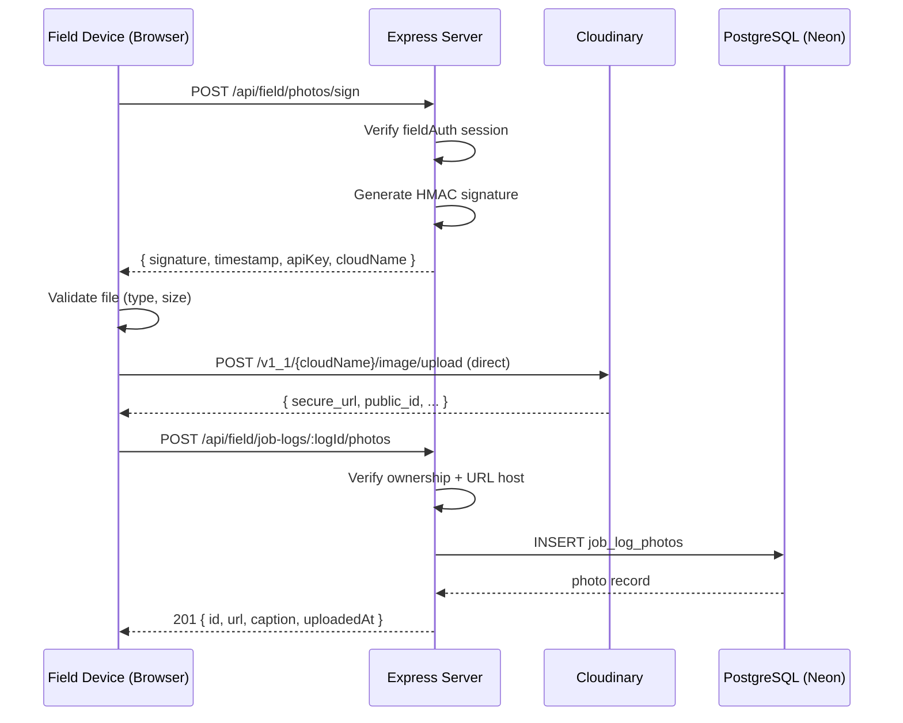

# Photo Attachments Architecture
## APS Job Log Photos — Implementation Blueprint

**Feature:** Photo Attachments for Job Logs  
**Status:** Ready for Implementation  
**Architect:** Akbar  
**Date:** 2026-03-08  

---

## 1. Overview

Field technicians can attach up to **5 photos per job log**. Photos are uploaded directly from the client to Cloudinary via **signed URLs** (server never handles image bytes). URLs are persisted in a `job_log_photos` child table linked to `job_logs` with cascade delete.

```
Field Device  ──sign req──►  /api/field/photos/sign  ──►  Cloudinary (signed params)
Field Device  ──upload ────►  Cloudinary (direct)
Field Device  ──save URL ──►  POST /api/field/job-logs/:logId/photos
```

---

## 2. Drizzle ORM Schema

### Add to `shared/schema.ts`

```typescript
// ─── Table Definition ────────────────────────────────────────────────────────
export const jobLogPhotos = pgTable("job_log_photos", {
  id: serial("id").primaryKey(),
  jobLogId: integer("job_log_id")
    .notNull()
    .references(() => jobLogs.id, { onDelete: "cascade" }),
  url: text("url").notNull(),
  caption: text("caption"),
  uploadedAt: timestamp("uploaded_at").defaultNow().notNull(),
});

// ─── Insert Schema (drizzle-zod) ──────────────────────────────────────────────
export const insertJobLogPhotoSchema = createInsertSchema(jobLogPhotos).omit({
  id: true,
  uploadedAt: true,
}).extend({
  url: z.string().url(),
  caption: z.string().max(200).optional().nullable(),
});

// ─── Types ────────────────────────────────────────────────────────────────────
export type InsertJobLogPhoto = z.infer<typeof insertJobLogPhotoSchema>;
export type JobLogPhoto = typeof jobLogPhotos.$inferSelect;
```

### Migration

```bash
npm run db:push
```

No raw SQL. Drizzle Kit handles cascade delete via the `references` option.

---

## 3. IStorage Interface Additions

### Add to `IStorage` interface in `server/storage.ts`

```typescript
// Job Log Photos
createJobLogPhoto(data: InsertJobLogPhoto): Promise<JobLogPhoto>;
getJobLogPhotos(jobLogId: number): Promise<JobLogPhoto[]>;
deleteJobLogPhoto(id: number, jobLogId: number): Promise<void>;
```

### DatabaseStorage Implementation

```typescript
async createJobLogPhoto(data: InsertJobLogPhoto): Promise<JobLogPhoto> {
  // Enforce 5-photo limit before insert
  const existing = await db
    .select()
    .from(jobLogPhotos)
    .where(eq(jobLogPhotos.jobLogId, data.jobLogId));
  if (existing.length >= 5) {
    throw new Error("MAX_PHOTOS_EXCEEDED");
  }
  const [photo] = await db.insert(jobLogPhotos).values(data).returning();
  return photo;
}

async getJobLogPhotos(jobLogId: number): Promise<JobLogPhoto[]> {
  return db
    .select()
    .from(jobLogPhotos)
    .where(eq(jobLogPhotos.jobLogId, jobLogId))
    .orderBy(jobLogPhotos.uploadedAt);
}

async deleteJobLogPhoto(id: number, jobLogId: number): Promise<void> {
  // jobLogId scoping prevents cross-log deletion
  await db
    .delete(jobLogPhotos)
    .where(and(eq(jobLogPhotos.id, id), eq(jobLogPhotos.jobLogId, jobLogId)));
}
```

---

## 4. API Routes

### Add to `server/routes.ts`

All routes under `/api/field/*` — protected by existing `requireFieldAuth` middleware.

---

#### `POST /api/field/photos/sign`
Generate Cloudinary signed upload parameters. **Client uploads directly to Cloudinary.**

```typescript
app.post("/api/field/photos/sign", requireFieldAuth, (req, res) => {
  const timestamp = Math.round(Date.now() / 1000);
  const folder = "aps-job-logs";

  const paramsToSign = {
    timestamp,
    folder,
    // Restrict to image/* at Cloudinary level
    allowed_formats: "jpg,jpeg,png,webp,heic",
    // Hard cap 5MB at Cloudinary level
    max_file_size: 5242880,
  };

  const signature = cloudinary.utils.api_sign_request(
    paramsToSign,
    process.env.CLOUDINARY_API_SECRET!
  );

  res.json({
    signature,
    timestamp,
    folder,
    cloudName: process.env.CLOUDINARY_CLOUD_NAME,
    apiKey: process.env.CLOUDINARY_API_KEY,
  });
});
```

---

#### `GET /api/field/job-logs/:logId/photos`
Fetch all photos for a log. Field employee can only see logs they own.

```typescript
app.get("/api/field/job-logs/:logId/photos", requireFieldAuth, async (req, res) => {
  const logId = parseInt(req.params.logId);
  // Verify ownership
  const log = await storage.getJobLog(logId);
  if (!log || log.employeeId !== req.session.fieldEmployeeId) {
    return res.status(403).json({ error: "Forbidden" });
  }
  const photos = await storage.getJobLogPhotos(logId);
  res.json(photos);
});
```

---

#### `POST /api/field/job-logs/:logId/photos`
Save a Cloudinary URL after successful direct upload.

```typescript
app.post("/api/field/job-logs/:logId/photos", requireFieldAuth, async (req, res) => {
  const logId = parseInt(req.params.logId);
  const log = await storage.getJobLog(logId);
  if (!log || log.employeeId !== req.session.fieldEmployeeId) {
    return res.status(403).json({ error: "Forbidden" });
  }

  // Validate body
  const parsed = insertJobLogPhotoSchema.safeParse({ ...req.body, jobLogId: logId });
  if (!parsed.success) {
    return res.status(400).json({ error: parsed.error.flatten() });
  }

  // Validate URL is actually from our Cloudinary account
  const cloudName = process.env.CLOUDINARY_CLOUD_NAME!;
  const allowedHost = `res.cloudinary.com/${cloudName}`;
  const urlObj = new URL(parsed.data.url);
  if (!urlObj.hostname.includes("cloudinary.com") || !urlObj.pathname.startsWith(`/${cloudName}`)) {
    return res.status(400).json({ error: "Invalid image host" });
  }

  try {
    const photo = await storage.createJobLogPhoto(parsed.data);
    res.status(201).json(photo);
  } catch (err: any) {
    if (err.message === "MAX_PHOTOS_EXCEEDED") {
      return res.status(422).json({ error: "Maximum 5 photos per log" });
    }
    throw err;
  }
});
```

---

#### `DELETE /api/field/job-logs/:logId/photos/:photoId`
Delete a photo record (does NOT delete from Cloudinary — handled separately or via lifecycle rules).

```typescript
app.delete("/api/field/job-logs/:logId/photos/:photoId", requireFieldAuth, async (req, res) => {
  const logId = parseInt(req.params.logId);
  const photoId = parseInt(req.params.photoId);
  const log = await storage.getJobLog(logId);
  if (!log || log.employeeId !== req.session.fieldEmployeeId) {
    return res.status(403).json({ error: "Forbidden" });
  }
  await storage.deleteJobLogPhoto(photoId, logId);
  res.status(204).send();
});
```

---

#### `GET /api/admin/job-logs/:logId/photos` _(Admin — protected by `requireAdmin`)_

```typescript
app.get("/api/admin/job-logs/:logId/photos", requireAdmin, async (req, res) => {
  const photos = await storage.getJobLogPhotos(parseInt(req.params.logId));
  res.json(photos);
});
```

---

## 5. Cloudinary Integration

### Environment Variables

Add to `.env` (server-side only — no `VITE_` prefix):

```env
CLOUDINARY_CLOUD_NAME=your_cloud_name
CLOUDINARY_API_KEY=your_api_key
CLOUDINARY_API_SECRET=your_api_secret
```

> ⚠️ `CLOUDINARY_API_SECRET` is never exposed to the client. The signing endpoint acts as a proxy.

### Server-Side Setup

Install: `npm install cloudinary`

Create `server/cloudinary.ts`:

```typescript
import { v2 as cloudinary } from "cloudinary";

cloudinary.config({
  cloud_name: process.env.CLOUDINARY_CLOUD_NAME,
  api_key: process.env.CLOUDINARY_API_KEY,
  api_secret: process.env.CLOUDINARY_API_SECRET,
});

export { cloudinary };
```

Import in `routes.ts`:
```typescript
import { cloudinary } from "./cloudinary";
```

### Client-Side Upload Flow

The client does a **two-step** process:

**Step 1 — Fetch signature:**
```typescript
// Called when user selects a file
const { signature, timestamp, folder, cloudName, apiKey } =
  await apiRequest("POST", "/api/field/photos/sign");
```

**Step 2 — Upload directly to Cloudinary:**
```typescript
const formData = new FormData();
formData.append("file", file);              // the File object
formData.append("api_key", apiKey);
formData.append("timestamp", timestamp);
formData.append("signature", signature);
formData.append("folder", folder);

const response = await fetch(
  `https://api.cloudinary.com/v1_1/${cloudName}/image/upload`,
  { method: "POST", body: formData }
);
const { secure_url } = await response.json();
```

**Step 3 — Save URL to our DB:**
```typescript
await apiRequest("POST", `/api/field/job-logs/${logId}/photos`, {
  url: secure_url,
  caption: captionText ?? null,
});
```

### Cloudinary Upload Preset (Recommended)

In the Cloudinary dashboard, create a **signed upload preset** named `aps_job_logs` with:
- Folder: `aps-job-logs`
- Max file size: 5 MB
- Allowed formats: `jpg, jpeg, png, webp, heic`
- Auto quality/format transformation: enabled (saves bandwidth)
- Eager transformation: `w_1200,c_limit,q_auto,f_auto` (resize large images on upload)

Reference the preset in the sign endpoint params instead of manual `allowed_formats` if desired.

---

## 6. Constraints & Validation

| Constraint | Enforcement Layer |
|---|---|
| Max 5 photos per log | `DatabaseStorage.createJobLogPhoto` (throws `MAX_PHOTOS_EXCEEDED`) |
| Max 5 MB per photo | Cloudinary upload preset + `max_file_size` in signed params |
| `image/*` only | Cloudinary `allowed_formats` + client `<input accept="image/*">` |
| URL must be from our Cloudinary account | Route handler URL validation (checks hostname + cloud name path) |
| Ownership check | Route handler verifies `log.employeeId === session.fieldEmployeeId` |
| Caption max length | Zod schema `.max(200)` |

### Client-Side Pre-Validation (before any upload)

```typescript
function validatePhoto(file: File): string | null {
  if (!file.type.startsWith("image/")) return "Only image files are allowed";
  if (file.size > 5 * 1024 * 1024) return "File must be under 5 MB";
  return null;
}
```

---

## 7. Security Model

| Threat | Mitigation |
|---|---|
| Unauthenticated upload | Sign endpoint requires `requireFieldAuth` session |
| Replay attack on signed params | Cloudinary signatures expire (default 1 hour TTL) |
| Upload to wrong account | `CLOUDINARY_API_SECRET` never leaves server; signature is account-bound |
| Arbitrary URL injection | Server validates URL hostname matches `res.cloudinary.com/{cloudName}` |
| SSRF via URL save | Same hostname validation; URL is never fetched server-side |
| Cross-log photo deletion | `deleteJobLogPhoto(id, jobLogId)` scopes delete to the specific log |
| Admin viewing another tenant's photos | Admin route pattern — APS is single-tenant, admin is trusted |
| Large payload storage costs | Cloudinary lifecycle rules: auto-delete after 1 year (configure in dashboard) |

---

## 8. PDF Report Integration

Per design spec, photos appear in an **Appendix page** (not inline in the table).

### In `client/src/lib/pdf-report.ts`

```typescript
// When building the PDF, after the main table:
async function appendPhotoPage(doc: jsPDF, photos: JobLogPhoto[]) {
  if (!photos.length) return;

  doc.addPage();
  doc.setFontSize(14).text("Photo Attachments", 14, 20);

  const colW = 60, colH = 45, padding = 8;
  let x = 14, y = 30;

  for (const photo of photos) {
    // Convert Cloudinary URL → base64 for jsPDF
    // Use Cloudinary's `fl_attachment` transform or fetch via proxy route
    const base64 = await urlToBase64(photo.url);
    doc.addImage(base64, "JPEG", x, y, colW, colH);
    if (photo.caption) {
      doc.setFontSize(8).text(photo.caption, x, y + colH + 4, { maxWidth: colW });
    }
    x += colW + padding;
    if (x > 190) { x = 14; y += colH + 20; }
  }
}

// CORS: use Cloudinary's `fl_attachment` flag OR add a proxy route:
// GET /api/field/photos/proxy?url=... (streams from Cloudinary, requires auth)
```

> ⚠️ **CORS Note:** jsPDF requires base64 data. Cloudinary URLs are publicly readable, but browser CORS headers on `res.cloudinary.com` may require the image to be fetched via a small server-side proxy route if CORS blocks direct canvas access. Add `fl_attachment` or configure CORS in Cloudinary settings.

---

## 9. Schema Change Workflow (Luke's Checklist)

```
[ ] 1. Add jobLogPhotos table + schema + types to shared/schema.ts
[ ] 2. npm run db:push
[ ] 3. Add IStorage methods (createJobLogPhoto, getJobLogPhotos, deleteJobLogPhoto)
[ ] 4. Implement DatabaseStorage methods
[ ] 5. Create server/cloudinary.ts
[ ] 6. Add env vars (CLOUDINARY_CLOUD_NAME, CLOUDINARY_API_KEY, CLOUDINARY_API_SECRET)
[ ] 7. Add routes to server/routes.ts (sign + CRUD)
[ ] 8. npm install cloudinary
[ ] 9. Build field-log.tsx photo upload UI (per design-specs.md)
[ ] 10. Build field-history.tsx photo display + lightbox
[ ] 11. Build admin photo grid in job log details
[ ] 12. Update pdf-report.ts with appendPhotoPage
```

---

## 10. Data Flow Diagram



---

*Architecture by Akbar — Steel City AI | Ready for Luke to implement.*
